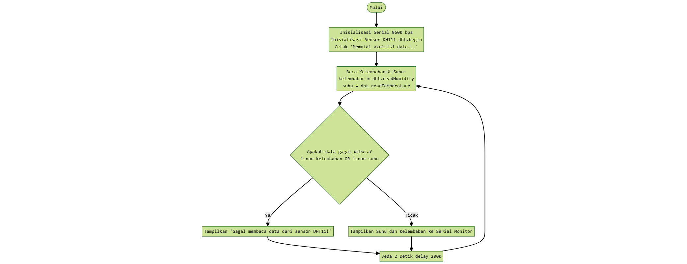

# Modul 1 - Sensor dan Aktuator

Program 1A berfungsi untuk membaca data suhu (°C) dan kelembaban udara (%) dari sensor **DHT11** yang terhubung ke pin GPIO, lalu menampilkan hasilnya ke **Serial Monitor**.

Program 2A ini berfungsi untuk membaca data suhu dari sensor **DHT11** dan mengontrol relay/aktuator (seperti pendingin atau indikator LED) secara otomatis berdasarkan ambang batas (*threshold*) suhu tertentu.

---

## Penjelasan Kode, Fungsi dan Percabangan pada Percobaan 1A

Program 1A berfungsi sebagai sistem akuisisi data lingkungan dasar yang membaca nilai temperatur (dalam °C) dan kelembaban udara relatif (dalam %) dari sensor DHT11 yang terhubung ke GPIO 4. Melalui fungsi loop(), mikrokontroler secara berkala mengambil data setiap 2 detik, melakukan pengecekan validitas data menggunakan fungsi isnan() untuk mengantisipasi kegagalan sensor, lalu mentransmisikan hasil pembacaan suhu dan kelembaban tersebut ke Serial Monitor dengan kecepatan komunikasi 9600 baud.

### Inisialisasi & Konfigurasi
* `#include <DHT.h>`: Mengimpor *library* Adafruit DHT untuk menyediakan fungsi-fungsi komunikasi dengan sensor DHT.
* `#define DHTPIN 4`: Menentukan pin GPIO 4 sebagai jalur komunikasi data digital dengan sensor.
* `#define DHTTYPE DHT11`: Menentukan spesifikasi jenis sensor yang digunakan, yaitu DHT11.
* `DHT dht(DHTPIN, DHTTYPE);`: Menginstansiasi objek `dht` dengan parameter pin (GPIO 4) dan tipe sensor (DHT11).

### Fungsi `setup()`
* `Serial.begin(9600);`: Membuka komunikasi serial asynchronous pada kecepatan transfer 9600 baud untuk pengiriman data ke Serial Monitor.
* `dht.begin();`: Mengaktifkan dan menginisialisasi proses sinyal *handshake* awal pada sensor DHT11.
* `Serial.println(...)`: Mengirimkan string teks ke Serial Monitor sebagai penanda awal dimulainya proses akuisisi data.

### Fungsi `loop()`
* **Pembacaan Data Sensor:**
  * `float kelembaban = dht.readHumidity();`: Mengambil nilai persentase kelembaban relatif (RH) dari sensor dan menyimpannya ke variabel ber tipe *floating-point*.
  * `float suhu = dht.readTemperature();`: Mengambil nilai temperatur dalam satuan Celsius dari sensor dan menyimpannya ke variabel ber tipe *floating-point*.
* **Penanganan Error (`if (isnan(...))`):**
  * `isnan(kelembaban) || isnan(suhu)`: Memeriksa apakah data hasil pembacaan bernilai *Not a Number* (NaN). Jika koneksi kabel terlepas atau *timing* baca gagal, sistem mencetak pesan error `"Gagal membaca data dari sensor DHT11!"` tanpa menghentikan program.
* **Pengiriman Data Serial:**
  * `Serial.print(...)` & `Serial.println(...)`: Mencetak gabungan string, nilai variabel `suhu` (°C), dan nilai `kelembaban` (%) ke Serial Monitor jika data terverifikasi valid.
* **Sampling Delay:**
  * `delay(2000);`: Memberikan jeda waktu 2000 milidetik (2 detik) sebelum eksekusi iterasi berikutnya, disesuaikan dengan *refresh rate* hardware sensor DHT11.

### Percabangan/Conditional
Block `if-else` pertama berfungsi sebagai mekanisme *error handling* untuk memastikan data yang dibaca dari sensor valid sebelum diproses lebih lanjut:

* **Kondisi `if (isnan(kelembaban) || isnan(suhu))`:**
  Fungsi `isnan()` (*Is Not a Number*) memeriksa apakah nilai kelembaban atau suhu bernilai bukan angka (Gagal dibaca/NaN). Operator logika `||` (OR) berarti jika **salah satu** atau **kedua** pembacaan gagal (misal karena kabel terlepas atau *timing* sensor error), kondisi dianggap **benar** (`TRUE`).
* **Blok `TRUE`:** Program akan mengeksekusi `Serial.println("Gagal membaca data dari sensor DHT11!");` untuk memberi tahu kegagalan komunikasi tanpa menghentikan jalannya sistem.
* **Blok `ELSE`:** Jika kedua data valid (`FALSE`), program masuk ke blok `else` untuk mencetak nilai suhu (°C) dan kelembaban (%) ke Serial Monitor.

---

## Penjelasan Kode, Fungsi dan Percabangan pada Percobaan 2A

Program 2A berfungsi sebagai sistem kontrol suhu otomatis sederhana yang membaca data temperatur dari sensor DHT11 pada GPIO 4 dan membandingkannya dengan ambang batas (threshold) sebesar 30.0 °C. Jika pembacaan suhu valid dan melebihi 30.0 °C, mikrokontroler akan memberikan sinyal HIGH pada GPIO 14 untuk mengaktifkan aktuator (relay atau LED) serta menampilkan status "Aktuator: ON" di Serial Monitor, sedangkan jika suhu berada di bawah atau sama dengan ambang batas, aktuator dimatikan (LOW) dengan status "Aktuator: OFF". Seluruh proses akuisisi data dan logika keputusan ini dieksekusi secara berulang setiap 2 detik.

### Inisialisasi & Konfigurasi
* `#include <DHT.h>`: Mengimpor *library* utama untuk membaca sensor DHT.
* `#define DHTPIN 4`: Menentukan pin GPIO 4 sebagai jalur data sensor.
* `#define DHTTYPE DHT11`: Menentukan jenis sensor yang digunakan (DHT11).
* `#define RELAYPIN 14`: Menentukan pin GPIO 14 sebagai pin kontrol aktuator (relay/LED).
* `DHT dht(DHTPIN, DHTTYPE);`: Membuat objek `dht` dengan parameter pin dan tipe sensor.
* `const float suhuThreshold = 30.0;`: Menentukan konstanta ambang batas suhu sebesar 30.0 °C.

### Fungsi `setup()`
* `Serial.begin(9600);`: Membuka jalur komunikasi serial pada kecepatan 9600 baud.
* `dht.begin();`: Mengaktifkan dan menginisialisasi sensor DHT11.
* `pinMode(RELAYPIN, OUTPUT);`: Mengatur pin GPIO 14 sebagai output untuk mengendalikan aktuator.
* `digitalWrite(RELAYPIN, LOW);`: Mengatur kondisi awal pin aktuator ke logika `LOW` (Mati) saat sistem pertama kali menyala.

### Fungsi `loop()`
* **Pembacaan Data:**
  * `float suhu = dht.readTemperature();`: Mengambil nilai suhu saat ini dalam satuan Celsius dan menyimpannya ke variabel `suhu`.
* **Penanganan Error (`if (isnan(suhu))`):**
  * Memeriksa apakah nilai `suhu` valid. Jika pembacaan gagal (*Not a Number*), program mencetak pesan `"Gagal membaca data sensor!"`.
* **Output Data & Logika Kontrol:**
  * `Serial.print(...)`: Menampilkan nilai suhu aktual ke Serial Monitor.
  * `if (suhu > suhuThreshold)`: Membandingkan suhu dengan ambang batas (30.0 °C).
    * Jika **Suhu > 30.0 °C**: Mengirim sinyal `HIGH` ke `RELAYPIN` (`digitalWrite(RELAYPIN, HIGH)`) untuk menyalakan aktuator dan mencetak `"Aktuator: ON"`.
    * Jika **Suhu ≤ 30.0 °C**: Mengirim sinyal `LOW` ke `RELAYPIN` (`digitalWrite(RELAYPIN, LOW)`) untuk mematikan aktuator dan mencetak `"Aktuator: OFF"`.
* **Delay Sampling:**
  * `delay(2000);`: Memberikan jeda waktu 2 detik sebelum melakukan pembacaan ulang pada siklus berikutnya.

### Percabangan/Conditional

Struktur percabangan pada kode 2A dibagi menjadi dua level (bertingkat) untuk menangani validasi data dan eksekusi kontrol aktuator:

1. Validasi Pembacaan Sensor (`isnan`)
* **Kondisi `if (isnan(suhu))`:**
  Memeriksa apakah data suhu bernilai *Not a Number* (NaN) akibat kegagalan komunikasi atau koneksi hardware.
* **Blok `TRUE`:** Mencetak pesan eror `"Gagal membaca data sensor!"` ke Serial Monitor dan mengabaikan proses evaluasi aktuator pada siklus tersebut.
* **Blok `ELSE`:** Jika data suhu valid (`FALSE`), program mencetak data suhu ke Serial Monitor dan masuk ke percabangan kontrol aktuator di dalamnya.

2. Kontrol Ambang Batas Aktuator (`suhuThreshold`)
Di dalam blok `else` validasi sensor, terdapat kondisi pembanding antara nilai suhu aktual dan variabel `suhuThreshold` (30.0 °C):

* **Kondisi `if (suhu > suhuThreshold)`:**
  * **Blok `TRUE` (Suhu > 30.0 °C):** Eksekusi `digitalWrite(RELAYPIN, HIGH)` untuk mengaktifkan relay/LED dan mencetak `"Aktuator: ON"`.
  * **Blok `ELSE` (Suhu ≤ 30.0 °C):** Eksekusi `digitalWrite(RELAYPIN, LOW)` untuk mematikan relay/LED dan mencetak `"Aktuator: OFF"`.

---

## Library / Dependencies

Kedua program memerlukan *library* utama dari **Adafruit** untuk menangani komunikasi protokol satu kabel (*single-wire protocol*) dengan sensor seri DHT.

| Library / Dependency | Versi Rekomendasi | Fungsi Utama |
| :--- | :--- | :--- |
| **DHT sensor library** | `^1.4.0` | Menyediakan objek `DHT` serta fungsi-fungsi utama seperti `dht.begin()`, `dht.readTemperature()`, dan `dht.readHumidity()`. |

---

## Pertanyaan Praktikum

### Percobaan 1A

1.  Gambarkan diagram alur (flowchart) proses akuisisi data sensor DHT22 pada program di atas! <br>
**Jawab:** <br>

2. Apa fungsi dari perintah isnan() pada program tersebut? <br>
**Jawab:**  Fungsi isnan() (Is Not a Number) digunakan untuk mengecek apakah variabel hasil pembacaan sensor (kelembaban atau suhu) bernilai NaN (bukan angka/invalid). Kondisi NaN biasanya terjadi ketika sensor mengalami kegagalan komunikasi, pulse timeout, kabel terlepas, atau kesalahan frame data hardware. Dengan isnan(), program dapat melakukan penanganan eror (error handling) agar tidak menampilkan nilai sampah/acak ke Serial Monitor.

3. Jelaskan mengapa diperlukan jeda (delay) minimal sekitar 2 detik antar pembacaan sensor DHT22! <br>
**Jawab:** Sensor seri DHT (khususnya DHT11 dan DHT22) menggunakan elemen sensor yang memiliki waktu respon termal dan fisik lambat. DHT22/DHT11 membutuhkan waktu sekitar 1 hingga 2 detik untuk menyelesaikan siklus pengukuran dan memperbarui register internalnya. Jika pembacaan dilakukan terlalu cepat (< 2 detik), internal sensor dapat mengalami peningkatan suhu akibat arus listrik (self-heating), sehingga pembacaan suhu menjadi tidak akurat. 

4. Modifikasi program agar data suhu dan kelembaban dirata-ratakan dari 5 kali pembacaan sebelum ditampilkan, dan berikan penjelasan di setiap baris kode yang ditambahkan dalam bentuk README.md! <br>
**Jawab:** <br>
    ``` cpp
    #include <DHT.h>
    #define DHTPIN 4
    #define DHTTYPE DHT11

    DHT dht(DHTPIN, DHTTYPE);

    void setup() {
    Serial.begin(9600);
    dht.begin();
    Serial.println("Memulai akuisisi data sensor DHT11...");
    }

    void loop() {
    // Inisialisasi variabel akumulator dan counter sampel valid
    float totalSuhu = 0.0;
    float totalKelembaban = 0.0;
    int jumlahValid = 0;

    // Perulangan untuk mengumpulkan 5 sampel pembacaan
    for (int i = 0; i < 5; i++) {
        float k = dht.readHumidity();    // Baca data kelembaban sampel saat ini
        float s = dht.readTemperature(); // Baca data suhu sampel saat ini

        // Validasi data: pastikan kedua nilai BUKAN NaN (angka valid)
        if (!isnan(k) && !isnan(s)) {
        totalSuhu += s;        // Akumulasi nilai suhu
        totalKelembaban += k;  // Akumulasi nilai kelembaban
        jumlahValid++;         // Tambah counter sampel yang berhasil
        } else {
        Serial.println("Pembacaan parsial gagal, dilewati...");
        }

        delay(2000); // Jeda 2 detik antar sampel sesuai spesifikasi fisik sensor
    }

    // Cek apakah ada minimal 1 sampel valid untuk menghindari divide-by-zero
    if (jumlahValid > 0) {
        // Hitung nilai rata-rata dari sampel yang valid
        float rataSuhu = totalSuhu / jumlahValid;
        float rataKelembaban = totalKelembaban / jumlahValid;

        // Tampilkan hasil perhitungan rata-rata ke Serial Monitor
        Serial.print("Rata-rata Suhu (");
        Serial.print(jumlahValid);
        Serial.print(" sampel): ");
        Serial.print(rataSuhu);
        Serial.print(" °C, Rata-rata Kelembaban: ");
        Serial.print(rataKelembaban);
        Serial.println(" %");
    } else {
        Serial.println("Gagal mendapatkan sampel data yang valid!");
    }
    }
    ```


### Percobaan 2A

1.  Mengapa diperlukan nilai ambang batas (threshold) dalam sistem kendali aktuator berbasis sensor?  <br>
**Jawab:** Nilai ambang batas (threshold) berfungsi sebagai kriteria pengambilan keputusan (decision-makingboundary) untuk mengubah data analog/kontinu dari sensor menjadi aksi digital (ON/OFF) pada aktuator.  Tanpa ambang batas, sistem tidak dapat menentukan kapan kondisi fisik memerlukan tindakan—seperti menyalakan kipas pendingin atau pemanas.  Ini memisahkan kondisi normal dari kondisi yang memerlukan intervensi otomatis.

2. Jelaskan apa yang akan terjadi apabila nilai suhuThreshold diturunkan menjadi sangat rendah, misalnya 20.0! <br>
**Jawab:**  Jika ambang batas diturunkan ke 20.0 °C, aktuator akan lebih sering atau terus-menerus berada dalam kondisi aktif (ON). Hal ini terjadi karena suhu ruangan normal (ambien) di iklim tropis umumnya berada di atas 20 °C (sekitar 24–30 °C). Dampak langsungnya yaitu pemborosan energi, komponen cepat aus/rusak dan sistem menjadi sangat sensitif.

3. Apa perbedaan antara kendali aktuator secara terus-menerus (kondisi tunggal) dengan kendali menggunakan histerisis (dua ambang batas)? <br>
**Jawab:** Kendali aktuator kondisi tunggal (single threshold) menggunakan satu titik batas keputusan, sehingga aktuator akan langsung berganti status (ON ke OFF atau sebaliknya) tepat saat sensor melewati titik nilai tersebut, yang berisiko menyebabkan efek chattering atau sakelar bergetar ON/OFF secara berulang dalam waktu singkat jika nilai sensor berfluktuasi tipis di sekitar ambang batas. Sebaliknya, kendali menggunakan histeresis (two thresholds) menerapkan dua titik ambang batas—yaitu batas atas untuk mengaktifkan aktuator dan batas bawah untuk mematikannya—yang menciptakan rentang deadband atau pita mati. Dengan adanya deadband ini, status aktuator tetap stabil dan tidak langsung mati saat suhu sedikit turun, sehingga memperpanjang umur mekanis relay/aktuator serta meningkatkan efisiensi energi sistem.

4. Modifikasi program agar menggunakan dua ambang batas (histerisis), misalnya aktuator menyala pada suhu di atas 30°C dan baru mati pada suhu di bawah 28°C, dan berikan penjelasan di setiap baris kode nya dalam bentuk README.md!  <br>
**Jawab:** <br>
    ``` cpp

    #include <DHT.h>

    #define DHTPIN 4           // pin data DHT22 terhubung ke GPIO 4
    #define DHTTYPE DHT11
    #define RELAYPIN 14        // pin kendali relay D5

    DHT dht(DHTPIN, DHTTYPE);

    // Mengganti 1 threshold dengan 2 ambang batas untuk logika histeresis
    const float suhuON = 30.0;  // Batas atas: Aktuator menyala jika suhu > 30.0 °C
    const float suhuOFF = 28.0; // Batas bawah: Aktuator mati jika suhu < 28.0 °C

    // Variabel status untuk menyimpan kondisi aktuator saat ini (false = OFF, true = ON)
    bool statusAktuator = false;

    void setup() {
    Serial.begin(9600);
    dht.begin();
    pinMode(RELAYPIN, OUTPUT);
    digitalWrite(RELAYPIN, LOW); // Pastikan aktuator mati di awal
    }

    void loop() {
    float suhu = dht.readTemperature();
    
    if (isnan(suhu)) {
        Serial.println("Gagal membaca data sensor!");
    } else {
        Serial.print("Suhu: ");
        Serial.print(suhu);
        Serial.print(" °C -> ");
        
        // Logika Kendali Histeresis
        if (suhu > suhuON) {
        statusAktuator = true;  // Aktuator menyala saat suhu melewati batas atas (30 °C)
        } else if (suhu < suhuOFF) {
        statusAktuator = false; // Aktuator baru mati saat suhu turun di bawah batas bawah (28 °C)
        }
        // Jika suhu berada di antara 28.0 °C dan 30.0 °C, statusAktuator TIDAK berubah (mempertahankan kondisi terakhir)

        // Eksekusi output ke pin relay berdasarkan variabel statusAktuator
        if (statusAktuator) {
        digitalWrite(RELAYPIN, HIGH);
        Serial.println("Aktuator: ON");
        } else {
        digitalWrite(RELAYPIN, LOW);
        Serial.println("Aktuator: OFF");
        }
    }
    
    delay(2000); // Jeda sampling pembacaan sensor
    }
    ```

---

## Dokumentasi

### Perakitan

<br>

### Percobaan 1A
<br><video controls src="img/WhatsApp Video 2026-09-04 at 23.24.33.mp4" title="Proses Percobaan 1A" width="30%"></video>
<br>

### Percobaan 2A
<br>
<br>