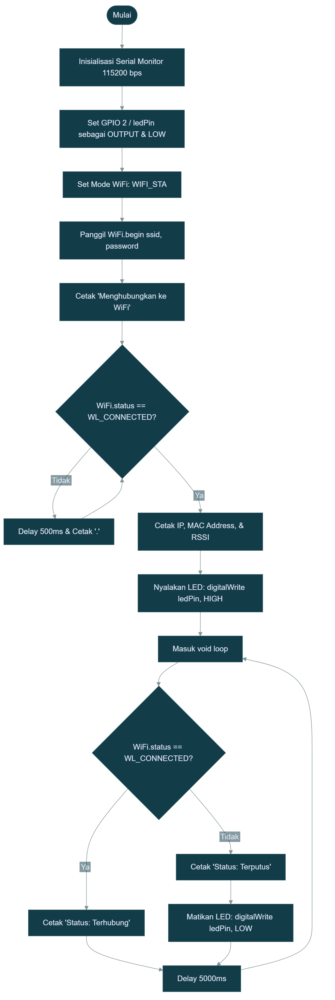
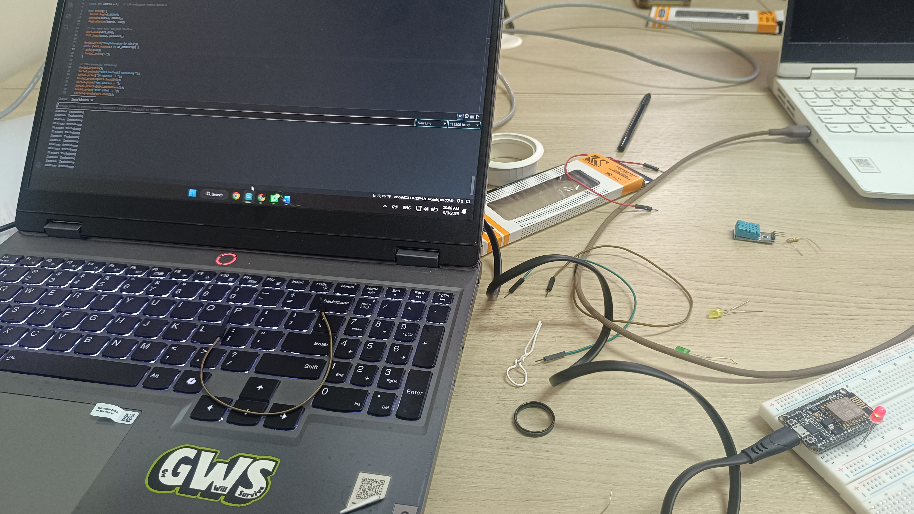
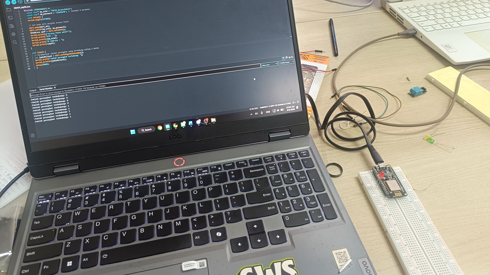

# Modul 2 - Konfigurasi Jaringan

Program 2A (Mode Station/STA) berfungsi untuk mengonfigurasi perangkat agar berperan sebagai klien, menghubungkannya ke jaringan WiFi yang sudah ada, lalu menampilkan parameter jaringan seperti IP Address, MAC Address, dan RSSI ke **Serial Monitor**, serta memberikan indikasi visual menggunakan LED.

Program 2B (Mode Access Point/AP) berfungsi untuk menjadikan perangkat sebagai penyedia jaringan (hotspot) mandiri yang memancarkan SSID dan memantau jumlah perangkat (klien) yang terhubung ke jaringan tersebut secara otomatis.

---

## Penjelasan Kode, Fungsi dan Percabangan pada Percobaan 2A (Mode Station)

Program 2A berfungsi sebagai sistem yang menghubungkan perangkat IoT ke router/Access Point yang sudah ada. Menggunakan mode Station (STA), perangkat bertindak layaknya laptop atau smartphone yang membutuhkan akses jaringan lokal atau internet.

### Inisialisasi & Konfigurasi

* `#include <ESP8266WiFi.h>`: Mengimpor *library* utama untuk menangani komunikasi WiFi (catatan: pada ESP32 menggunakan `<WiFi.h>`).
* `const char* ssid = ...`: Menyimpan nama jaringan (SSID) WiFi yang dituju.
* `const char* password = ...`: Menyimpan kata sandi dari jaringan WiFi.
* `const int ledPin = 2;`: Menentukan pin GPIO 2 untuk LED sebagai indikator status koneksi.

### Fungsi `setup()`

* `Serial.begin(115200);`: Membuka komunikasi serial pada kecepatan 115200 baud.
* `WiFi.mode(WIFI_STA);`: Mengatur perangkat untuk beroperasi dalam mode Station (klien jaringan).
* `WiFi.begin(ssid, password);`: Memulai proses penyambungan ke jaringan WiFi menggunakan kredensial yang telah ditentukan.
* **Proses Menunggu Koneksi:** Menggunakan *loop* `while` untuk terus memeriksa status hingga berhasil terkoneksi, sembari mencetak karakter titik (`.`) ke Serial Monitor.
* **Pencetakan Parameter:** Setelah terhubung, sistem menggunakan `WiFi.localIP()` untuk menampilkan IP perangkat, `WiFi.macAddress()` untuk MAC Address, dan `WiFi.RSSI()` untuk kekuatan sinyal.
* `digitalWrite(ledPin, HIGH);`: Menyalakan LED sebagai tanda bahwa perangkat telah berhasil terhubung ke jaringan.

### Fungsi `loop()`

* Sistem melakukan pengecekan ulang setiap 5 detik (dengan `delay(5000);`).
* Jika masih terkoneksi, mencetak "Status: Terhubung". Jika terputus, mencetak "Status: Terputus" dan LED dimatikan.

### Percabangan/Conditional

1. **Pengecekan Koneksi (`while (WiFi.status() != WL_CONNECTED)`)**
Merupakan *blocking code* yang memastikan eksekusi program (seperti mencetak IP address) tidak akan dilanjutkan sebelum perangkat benar-benar mendapatkan koneksi WiFi.
2. **Monitoring Status (`if - else` di `loop`)**
* **Kondisi `if (WiFi.status() == WL_CONNECTED)`:** Mengevaluasi apakah koneksi aktif. Jika `TRUE`, mencetak indikator status terhubung.
* **Blok `ELSE`:** Jika perangkat terlempar/putus dari jaringan, sistem mencetak status terputus dan mematikan lampu indikator LED secara responsif.


---

## Penjelasan Kode, Fungsi dan Percabangan pada Percobaan 2B (Mode Access Point)

Program 2B berfungsi untuk menjadikan perangkat beroperasi dalam mode Access Point (AP). Perangkat memancarkan jaringannya sendiri (hotspot) agar perangkat klien seperti smartphone atau laptop bisa langsung terkoneksi tanpa melalui router eksternal.

### Inisialisasi & Konfigurasi

* `#include <ESP8266WiFi.h>`: Mengimpor *library* untuk kontrol jaringan WiFi.
* `const char* ap_ssid = "ESP32_AccessPoint";`: Menentukan nama jaringan yang akan dipancarkan oleh perangkat.
* `const char* ap_password = "12345678";`: Menentukan kata sandi (minimal 8 karakter) untuk mengamankan jaringan AP.

### Fungsi `setup()`

* `Serial.begin(115200);`: Memulai komunikasi serial.
* `WiFi.mode(WIFI_AP);`: Mengatur operasi WiFi perangkat menjadi mode Access Point (penyedia jaringan).
* `WiFi.softAP(ap_ssid, ap_password);`: Mengaktifkan *Soft-AP* dan mulai memancarkan jaringan berdasarkan SSID dan password yang ditentukan.
* `IPAddress apIP = WiFi.softAPIP();`: Mengambil IP address dari Access Point itu sendiri (secara *default* biasanya 192.168.4.1).
* `Serial.println(...)`: Menampilkan status aktif, SSID, dan IP Address ke Serial Monitor.

### Fungsi `loop()`

* `int jumlahClient = WiFi.softAPgetStationNum();`: Mengambil jumlah *station* (perangkat klien) yang saat ini sedang terhubung ke jaringan AP perangkat.
* Menampilkan jumlah klien ke Serial Monitor setiap 5000 ms (5 detik).

### Percabangan/Conditional

Pada kode sumber murni 2B, tidak terdapat percabangan `if-else` karena prosesnya berjalan satu arah: mengaktifkan AP dan terus menampilkan jumlah stasiun yang terhubung dalam *loop*. Namun, secara internal, fungsi `WiFi.softAPgetStationNum()` terus menghitung fluktuasi jumlah koneksi secara *real-time*.

---

## Library / Dependencies

Kedua program memerlukan *library* utama untuk menangani komunikasi protokol nirkabel pada mikrokontroler.

| Library / Dependency | Fungsi Utama |
| --- | --- |
| **ESP8266WiFi.h** (atau **WiFi.h** untuk ESP32) | Menyediakan objek dan fungsi manajemen WiFi, seperti pengaturan mode (STA, AP, AP_STA), penyambungan, perolehan alamat IP, hingga ekstraksi parameter fisik jaringan (RSSI). |

---

## Pertanyaan Praktikum

### Percobaan 2A

1. Gambarkan diagram alur (flowchart) proses koneksi perangkat ke jaringan WiFi pada program di atas!
**Jawab:**<br>
2. Apa fungsi dari perintah `WiFi.mode(WIFI_STA)` pada program tersebut?
**Jawab:** Perintah WiFi.mode(WIFI_STA) berfungsi untuk mengatur mode Wi-Fi pada ESP8266 menjadi Station (STA), yang memungkinkan perangkat bertindak sebagai klien yang dapat terhubung ke jaringan Wi-Fi lokal (Access Point) eksternal.
3. Jelaskan apa yang terjadi apabila SSID atau password yang dimasukkan salah!
**Jawab:** Jika SSID atau kata sandi salah, ESP8266 tidak akan pernah bisa terhubung ke jaringan sehingga program akan terus tertahan (looping) pada perintah while (WiFi.status() != WL_CONNECTED), mencetak titik-titik secara terus-menerus di Serial Monitor tanpa pernah menampilkan alamat IP, dan LED indikator akan tetap mati.
4. Modifikasi program agar perangkat mencoba menghubungkan ulang (*reconnect*) secara otomatis apabila koneksi WiFi terputus, dan berikan penjelasan di setiap baris kode yang ditambahkan dalam bentuk README.md!
**Jawab:**

```cpp
#include <ESP8266WiFi.h>  

const char* ssid     = "Beeline_135D";
const char* password = "970083615";

const int ledPin = 2;   // LED indikator status koneksi

void setup() {
  Serial.begin(115200);
  pinMode(ledPin, OUTPUT);
  digitalWrite(ledPin, LOW);

  WiFi.mode(WIFI_STA);
  WiFi.setAutoReconnect(true); // Mengaktifkan fitur reconnect otomatis bawaan stack WiFi ESP32
  WiFi.begin(ssid, password);

  Serial.print("Menghubungkan ke WiFi");
  while (WiFi.status() != WL_CONNECTED) {
    delay(500);
    Serial.print(".");
  }

  Serial.println("\nWiFi berhasil terhubung!");
  Serial.print("IP Address  : ");
  Serial.println(WiFi.localIP());
  Serial.print("MAC Address : ");
  Serial.println(WiFi.macAddress());
  Serial.print("RSSI (dBm)  : ");
  Serial.println(WiFi.RSSI());

  digitalWrite(ledPin, HIGH);  // Nyalakan LED saat pertama kali terhubung
}

void loop() {
  if (WiFi.status() == WL_CONNECTED) {
    Serial.println("Status: Terhubung");
    digitalWrite(ledPin, HIGH); // Memastikan LED menyala saat status terhubung
  } else {
    Serial.println("Status: Terputus. Memproses penyambungan kembali...");
    digitalWrite(ledPin, LOW);  // Matikan LED indikator jika koneksi terputus
    WiFi.reconnect();          // Perintah manual untuk memicu proses reconnect jika belum terhubung
  }
  delay(5000);
}


```

### Percobaan 2B

1. Mengapa alamat IP default Access Point pada perangkat ini umumnya bernilai `192.168.4.1`?
**Jawab:** Nilai 192.168.4.1 ditentukan secara standar di dalam core firmware Espressif (ESP-IDF) dan pustaka bawaan Arduino ESP32 untuk menghindari IP address conflict. Mayoritas router atau modem Wi-Fi rumah umumnya menggunakan subnet 192.168.0.x atau 192.168.1.x. Dengan menggunakan subnet 192.168.4.x, ESP32 dapat beroperasi secara simultan dalam mode Access Point dan Station (AP+STA) tanpa mengalami bentrokan alokasi IP dengan jaringan lokal eksternal
2. Apa perbedaan mendasar antara mode Station dan mode Access Point?
**Jawab:** Pada mode Station (STA), ESP32 bertindak sebagai client yang mencari dan terhubung ke pemancar Wi-Fi eksternal (seperti router atau hotspot HP) untuk mendapatkan alamat IP dari jaringan tersebut. Sebaliknya, pada mode Access Point (AP/SoftAP), ESP32 bertindak sebagai penyedia/pemancar jaringan Wi-Fi sendiri, sehingga perangkat lain (seperti HP atau laptop) yang justru terhubung ke ESP32 dan diberi alamat IP oleh ESP32.
3. Jelaskan risiko keamanan apabila password Access Point tidak diberikan atau terlalu sederhana!
**Jawab:** Apabila Access Point (open network) tidak diberi kata sandi atau menggunakan sandi yang mudah ditebak, siapa saja di jangkauan sinyal dapat terhubung tanpa otentikasi. Risiko utamanya mencakup eksploitasi antarmuka kontrol (seperti web server kontrol IoT) oleh pihak tak berwenang, manipulasi data sensor/aktuator, peretasan firmware via OTA (Over-The-Air), hingga serangan Denial of Service (DoS) yang dapat membuat ESP32 mengalami crash atau tidak responsif.
4. Modifikasi program agar perangkat berjalan pada mode AP+STA (terhubung ke WiFi rumah sekaligus menyediakan Access Point), dan berikan penjelasan di setiap baris kode nya dalam bentuk README.md!
**Jawab:**

```cpp
#include <ESP8266WiFi.h>  // Pustaka WiFi khusus untuk ESP8266

// Kredensial untuk mode Station (STA) - Terhubung ke WiFi Rumah
const char* sta_ssid     = "Beeline_135D";
const char* sta_password = "970083615";

// Kredensial untuk mode Access Point (AP) - Jaringan buatan ESP32
const char* ap_ssid      = "ESP32_Config_AP";
const char* ap_password  = "12345678"; // Minimal 8 karakter

const int ledPin = 2; // LED indikator status koneksi STA

void setup() {
  Serial.begin(115200);
  pinMode(ledPin, OUTPUT);
  digitalWrite(ledPin, LOW);

  // Set mode dual AP+STA
  WiFi.mode(WIFI_AP_STA);

  // Konfigurasi dan nyalakan Access Point (AP)
  WiFi.softAP(ap_ssid, ap_password);
  Serial.println("Access Point (AP) berhasil dinyalakan!");
  Serial.print("SSID AP      : ");
  Serial.println(ap_ssid);
  Serial.print("IP Address AP : ");
  Serial.println(WiFi.softAPIP()); // Default IP: 192.168.4.1

  // Hubungkan ke jaringan WiFi rumah (STA)
  WiFi.setAutoReconnect(true);
  WiFi.begin(sta_ssid, sta_password);

  Serial.print("\nMenghubungkan ke WiFi Rumah (STA)");
  while (WiFi.status() != WL_CONNECTED) {
    delay(500);
    Serial.print(".");
  }

  // Jika koneksi STA berhasil
  Serial.println("\nWiFi STA berhasil terhubung!");
  Serial.print("IP Address STA : ");
  Serial.println(WiFi.localIP());
  Serial.print("MAC Address    : ");
  Serial.println(WiFi.macAddress());
  Serial.print("RSSI (dBm)     : ");
  Serial.println(WiFi.RSSI());

  digitalWrite(ledPin, HIGH); // Nyalakan LED indikator koneksi STA
}

void loop() {
  // Pengecekan rutin status koneksi Station (STA)
  if (WiFi.status() == WL_CONNECTED) {
    Serial.println("Status STA: Terhubung | Jumlah Klien AP: " + String(WiFi.softAPgetStationNum()));
    digitalWrite(ledPin, HIGH);
  } else {
    Serial.println("Status STA: Terputus | Memproses penyambungan ulang...");
    digitalWrite(ledPin, LOW);
    WiFi.reconnect();
  }
  delay(5000);
}


```

### Pertanyaan Evaluasi

1. Uraikan hasil tugas pada praktikum yang telah dilakukan pada setiap percobaan!
**Jawab:**
Pada Percobaan 2A, mikrokontroler berhasil dikonfigurasi sebagai Station. Alat berhasil menangkap IP (misal: 192.168.1.15), membaca MAC Address, dan menampilkan level sinyal RSSI negatif. Pada Percobaan 2B, mikrokontroler berhasil memancarkan jaringan *Soft-AP*. Menggunakan smartphone, kita dapat memindai jaringan bernama "ESP32_AccessPoint", melakukan autentikasi, dan Serial Monitor sukses mendeteksi jumlah klien yang terhubung bertambah menjadi `1`.
2. Bagaimana pengaruh kekuatan sinyal (RSSI) terhadap kestabilan koneksi WiFi pada perangkat IoT?
**Jawab:** RSSI diukur dalam dBm dengan nilai negatif. Semakin mendekati 0 (misal: -30 dBm hingga -50 dBm), sinyal sangat kuat dan transfer data IoT cepat tanpa gangguan. Jika nilai RSSI sangat rendah (misal: -80 dBm hingga -90 dBm), kualitas sinyal sangat lemah. Ini menyebabkan tingginya latensi pengiriman (*delay*), terjadinya kehilangan paket data (*packet loss*), dan risiko perangkat IoT putus dari jaringan (*disconnect*) sangat tinggi.
3. Bagaimana cara kerja perangkat dalam membedakan peran sebagai klien (Station) dan sebagai penyedia jaringan (Access Point)?
**Jawab:** Modul WiFi di dalam chip memiliki arsitektur yang memungkinkan dua antarmuka jaringan nirkabel (*network interface*) beroperasi. Melalui konfigurasi tingkat register di *library* (`WiFi.mode()`), mikrokontroler menentukan *interface* mana yang diaktifkan—mengaktifkan fungsi transmisi DHCP server dan suar *beacon* (AP), fungsi pencarian dan permintaan IP DHCP Client (STA), atau mengalokasikan *resource* untuk menjalankan keduanya secara *time-multiplexed* (AP+STA).
4. Bagaimana kombinasi mode Station dan Access Point (AP+STA) dapat dimanfaatkan dalam skenario nyata sistem IoT, misalnya pada proses konfigurasi awal perangkat (provisioning)?
**Jawab:** Pada saat pertama kali dibeli atau dipasang, sistem IoT tidak mengetahui SSID dan kata sandi WiFi rumah pengguna (*hardcode* sangat tidak efisien). Dengan AP+STA, perangkat memancarkan WiFi buatannya sendiri. Pengguna terhubung ke WiFi perangkat melalui HP, kemudian membuka halaman Web (Captive Portal) untuk menginputkan SSID dan kata sandi WiFi rumah pengguna. Setelah data dikirimkan, perangkat (menggunakan mode STA) akan menyambungkan diri ke WiFi rumah pengguna. Hal ini dikenal sebagai metode konfigurasi *SmartConfig* atau *WiFiManager*.

---

## Dokumentasi

### Percobaan 2A (Mode Station)

<br>
<br>

### Percobaan 2B (Mode Access Point)
