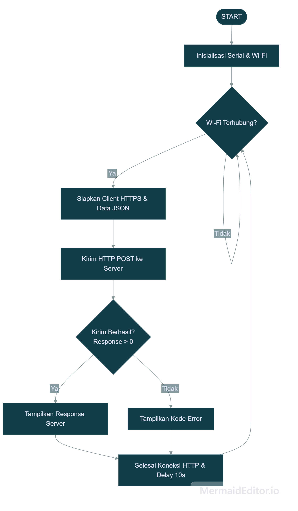
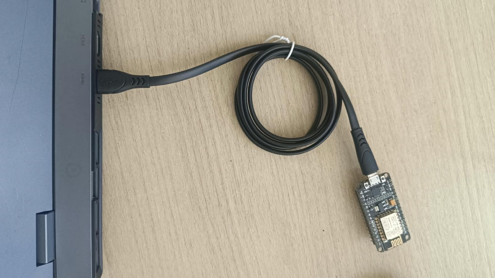

# Modul 3 - Protokol Komunikasi IoT (HTTP dan MQTT dengan Format JSON)

Program 3A (Komunikasi HTTP) berfungsi untuk mengonfigurasi perangkat agar dapat mengirimkan data telemetry (simulasi suhu dan kelembaban) ke *server/endpoint* eksternal melalui protokol HTTP menggunakan metode **POST** dengan payload berformat JSON.

Program 3B (Komunikasi MQTT) berfungsi untuk mengonfigurasi perangkat agar terhubung ke *broker* MQTT publik dan bertindak sebagai *publisher* yang mempublikasikan data sensor secara periodik ke suatu *topic* dengan format JSON menggunakan arsitektur *publish-subscribe*.

---

## Penjelasan Kode, Fungsi dan Percabangan pada Percobaan 3A (Komunikasi HTTP)

Program 3A berfungsi sebagai sistem transmisi data *point-to-point* berbasis *request-response* dari mikrokontroler (klien) ke web server (`httpbin.org/post`).

### Inisialisasi & Konfigurasi

* `#include <ESP8266WiFi.h>`: Mengimpor pustaka utama kontrol nirkabel WiFi pada ESP8266 (dapat disesuaikan dengan `<WiFi.h>` jika menggunakan ESP32).
* `#include <ESP8266HTTPClient.h>`: Mengimpor pustaka penanganan protokol HTTP klien.
* `#include <WiFiClientSecure.h>`: Mengimpor pustaka enkripsi TLS/SSL untuk menangani koneksi HTTPS.
* `#include <ArduinoJson.h>`: Mengimpor pustaka manipulasi, serialisasi, dan deserialisasi data format JSON.
* `const char* ssid = ...`: Menyimpan nama SSID jaringan WiFi target.
* `const char* password = ...`: Menyimpan kata sandi jaringan WiFi.
* `const char* serverUrl = ...`: Menyimpan URL *endpoint* server uji HTTPS.

### Fungsi `setup()`

* `Serial.begin(115200);`: Membuka komunikasi serial pada kecepatan 115200 baud rate.
* `WiFi.begin(ssid, password);`: Memulai instansiasi penyambungan nirkabel ke Access Point.
* **Proses Menunggu Koneksi:** Menggunakan *looping* `while (WiFi.status() != WL_CONNECTED)` untuk menahan eksekusi hingga koneksi jaringan berhasil terbentuk, ditandai dengan pencetakan karakter titik (`.`).

### Fungsi `loop()`

* **Inisialisasi Client & HTTPS:** `WiFiClientSecure client;` dibuat lalu dipanggil `client.setInsecure();` guna mengabaikan verifikasi sertifikat SSL (memfasilitasi pengujian HTTPS tanpa *CA certificate*).
* **Konfigurasi HTTP Client:** `http.begin(client, serverUrl);` membuka sesi transaksi data ke server.
* `http.addHeader("Content-Type", "application/json");`: Menambahkan header HTTP untuk memberitahu server bahwa payload yang dikirimkan berformat JSON.
* **Penyusunan Data JSON:** Objek `JsonDocument doc;` menampung pasangan *key-value* data (`suhu` dan `kelembaban`).
* **Serialisasi Data:** `serializeJson(doc, requestBody);` mengonversi struktur objek JSON ke variabel bertipe `String`.
* **Pengiriman Payload:** `int httpResponseCode = http.POST(requestBody);` mengeksekusi metode HTTP POST dan mengembalikan kode status response dari server.
* **Terminasi Sesi:** `http.end();` menutup koneksi socket HTTP untuk membebaskan memori. Sesi diulang setiap 10 detik (`delay(10000);`).

### Percabangan/Conditional

1. **Pengecekan Status WiFi (`if (WiFi.status() == WL_CONNECTED)`)**
Memastikan bahwa transaksi data HTTP hanya akan dijalankan jika antarmuka WiFi dalam keadaan terhubung.
2. **Pengecekan Response Server (`if (httpResponseCode > 0)`)**

* **Kondisi `TRUE`:** Berarti request berhasil terkirim dan server memberikan balasan response code (misal: 200 OK). Program lalu mencetak isi balasan server menggunakan `http.getString()`.
* **Blok `ELSE`:** Menandakan kegagalan transmisi HTTP (misal: timeout, unreachable host) dan mencetak kode error minus (seperti -1 untuk *connection refused*).

---

## Penjelasan Kode, Fungsi dan Percabangan pada Percobaan 3B (Komunikasi MQTT)

Program 3B berfungsi sebagai penyedia data (*publisher*) yang mengirimkan informasi sensor ke *Broker* MQTT (`broker.hivemq.com`), sehingga dapat diterima oleh perangkat lain (*subscriber*) yang mendengarkan *topic* yang sama.

### Inisialisasi & Konfigurasi

* `#include <PubSubClient.h>`: Pustaka utama untuk mengimplementasikan protokol MQTT (*publish/subscribe*).
* `const char* mqttServer = "broker.hivemq.com";`: Alamat host *broker* MQTT publik.
* `const int mqttPort = 1883;`: Port standar komunikasi MQTT unencrypted.
* `const char* mqttTopic = "unsoed/tk245004/kelompok2/sensor";`: Jalur *topic* spesifik pengelompokan data.
* `WiFiClient espClient;` & `PubSubClient client(espClient);`: Inisialisasi instansiasi transport layer jaringan dan klien MQTT.

### Fungsi `hubungkanWiFi()`

Fungsi pembantu (*helper*) untuk menginisialisasi dan menahan alur program hingga ESP8266 terhubung penuh ke jaringan WiFi.

### Fungsi `hubungkanMQTT()`

* Menggunakan *loop* `while (!client.connected())` untuk memastikan status koneksi ke broker.
* `String clientId = "ESP8266Client-" + String(random(0xffff), HEX);`: Membangun *Client ID* unik secara acak untuk menghindari konflik identitas koneksi pada *broker*.
* `if (client.connect(clientId.c_str()))`: Mencoba membuka sesi koneksi ke *broker*. Jika gagal, sistem akan menampilkan kode *state error* (`client.state()`) dan mencoba kembali setiap 2 detik.

### Fungsi `setup()`

* Memanggil `hubungkanWiFi()`.
* `client.setServer(mqttServer, mqttPort);`: Mengonfigurasi parameter alamat dan port target *broker* MQTT.

### Fungsi `loop()`

* **Pemeriksaan Koneksi:** Menguji status `client.connected()`. Jika terputus, memanggil `hubungkanMQTT()`.
* `client.loop();`: Fungsi wajib yang memproses *keep-alive*, *ping packet*, dan pemrosesan pesan masuk pada *stack* PubSubClient.
* **Penyusunan & Pengiriman Data:** Menyusun payload JSON via `JsonDocument`, mengonversinya menjadi *character array* (`buffer`), kemudian mempublikasikannya menggunakan `client.publish(mqttTopic, buffer);`. Pointers pesan dikirim berkala setiap 5 detik.

### Percabangan/Conditional

1. **Pengecekan Koneksi MQTT (`if (!client.connected())`)**
Menjamin proses *publish* data tidak akan dipaksakan jika hubungan socket TCP ke broker MQTT belum terbentuk/terputus.
2. **Proses Autentikasi/Handshake MQTT (`if (client.connect(...))`)**

* **Kondisi `TRUE`:** Berhasil *connect*, program mencetak pesan konfirmasi ke Serial Monitor.
* **Blok `ELSE`:** Gagal terhubung, program mencetak kode status kesalahan (`rc`) dan melakukan *retry delay* 2000 ms.

---

## Library / Dependencies

| Library / Dependency | Fungsi Utama |
| --- | --- |
| **ESP8266WiFi.h** (atau **WiFi.h**) | Mengelola koneksi nirkabel fisik/datalink layer ke jaringan Wi-Fi lokal. |
| **ESP8266HTTPClient.h** | Menangani penyusunan header, pembentukan method (GET, POST), dan transmisi protokol HTTP. |
| **WiFiClientSecure.h** | Menyediakan antarmuka koneksi terenkripsi berbasis TLS/SSL (HTTPS). |
| **PubSubClient.h** | Mengimplementasikan protokol MQTT (connect, publish, subscribe, loop keep-alive). |
| **ArduinoJson.h** | Mengelola alokasi memori, konstruksi objek key-value, serta serialisasi JSON. |

---

## Pertanyaan Praktikum

### Percobaan 3A

1. Gambarkan diagram alur (flowchart) proses pengiriman data melalui HTTP POST pada program di atas!
**Jawab:**
<br></img>

2. Apa fungsi dari perintah `http.addHeader("Content-Type", "application/json")` pada program tersebut?
**Jawab:** Perintah tersebut berfungsi menyisipkan informasi metadata pada header permintaan (request) HTTP yang memberitahukan server penerima bahwa body payload yang dikirimkan berformat JSON.

3. Jelaskan arti dari kode response HTTP 200 dan sebutkan salah satu contoh kode response HTTP lain beserta artinya!
**Jawab:** Menandakan bahwa permintaan (request) HTTP POST yang dikirimkan berhasil diterima dan diproses server tanpa kendala. Server mengembalikan balasan valid sesuai endpoint. Contoh lain yaitu 404 (Not Found) Server tidak dapat menemukan resource atau URL (endpoint) yang diminta klien.

4. Modifikasi program agar ESP32/ESP8266 dapat mengirimkan data tambahan berupa waktu (dalam milidetik sejak dinyalakan menggunakan `millis()`) ke dalam JSON yang dikirim, dan berikan penjelasan di setiap baris kode yang ditambahkan dalam bentuk README.md!
**Jawab:**

```cpp
#include <ESP8266WiFi.h>
#include <ESP8266HTTPClient.h>
#include <WiFiClientSecure.h>
#include <ArduinoJson.h>

const char* ssid = "Hazee";
const char* password = "abcd1234";
const char* serverUrl = "https://httpbin.org/post";

void setup() {
  Serial.begin(115200);
  WiFi.begin(ssid, password);

  Serial.print("Menghubungkan ke WiFi");
  while (WiFi.status() != WL_CONNECTED) {
    delay(500);
    Serial.print(".");
  }
  Serial.println();
  Serial.println("WiFi berhasil terhubung!");
}

void loop() {
  if (WiFi.status() == WL_CONNECTED) {
    WiFiClientSecure client;
    client.setInsecure(); 

    HTTPClient http;
    http.begin(client, serverUrl);
    http.addHeader("Content-Type", "application/json");

    JsonDocument doc;
    doc["suhu"] = 28.5;
    doc["kelembaban"] = 65.0;
    
    // --- PENAMBAHAN DATA WAKTU ---
    doc["waktu_ms"] = millis(); // Menyimpan timestamp milidetik sejak ESP dinyalakan

    String requestBody;
    serializeJson(doc, requestBody);

    Serial.print("Mengirim data: ");
    Serial.println(requestBody);

    int httpResponseCode = http.POST(requestBody);

    if (httpResponseCode > 0) {
      Serial.print("Kode Response HTTP: ");
      Serial.println(httpResponseCode);
      Serial.println("Isi Response:");
      Serial.println(http.getString());
    } else {
      Serial.print("Pengiriman gagal, kode error: ");
      Serial.println(httpResponseCode);
    }

    http.end();
  }

  delay(10000);
}

```
Penjelasan program:
doc["waktu_ms"]: Membuat pasangan key-value baru di dalam objek JsonDocument dengan nama kunci (key) "waktu_ms".
millis(): Fungsi bawaan framework Arduino/ESP yang mengembalikan nilai berupa angka bertipe unsigned long, merepresentasikan interval waktu aktif sistem dalam milidetik.
Perilaku Output: Saat fungsi serializeJson(doc, requestBody) dieksekusi, string JSON yang dihasilkan akan berubah format menjadi:
{
  "suhu": 28.5,
  "kelembaban": 65.0,
  "waktu_ms": 15420
}

---

### Percobaan 3B

1. Apa fungsi dari topic pada protokol MQTT, dan mengapa topic yang digunakan perlu dibuat unik?
**Jawab:** Topic pada MQTT berfungsi sebagai pengalamatan berbasis teks (UTF-8 string) yang menyaring dan mendistribusikan pesan dari publisher ke subscriber yang telah mendaftar (subscribe) pada topic yang sama pada broker. Topic dibuat unik agar data yang dipublikasikan tidak tercampur dengan data milik perangkat/pengguna lain.

2. Jelaskan fungsi dari perintah `client.loop()` yang dipanggil pada setiap iterasi `loop()`!
**Jawab:** Perintah client.loop() berfungsi menjalankan pemrosesan internal pustaka PubSubClient secara berkala dengan cara mengirimkan paket ping (keep-alive) agar koneksi ke broker tetap terjaga, memproses pesan masuk untuk diteruskan ke fungsi callback, serta mengelola buffer jaringan guna mencegah penumpukan data.

3. Apa yang akan terjadi apabila koneksi ke broker MQTT terputus di tengah program berjalan?
**Jawab:** Saat koneksi terputus, instruksi client.publish() akan gagal mengirimkan data, lalu pada iterasi berikutnya kondisi !client.connected() akan memicu fungsi hubungkanMQTT() untuk melakukan blocking loop penyambungan ulang setiap 2 detik hingga koneksi pulih, yang menyebabkan pengiriman data baru tertunda selama proses tersebut.

---

## Pertanyaan Analisis

1. Uraikan hasil tugas pada praktikum yang telah dilakukan pada setiap percobaan!
**Jawab:** Pada Percobaan 3A, mikrokontroler berhasil terhubung ke WiFi, menyusun payload JSON berisi data suhu dan kelembaban, serta mengunggahnya ke server httpbin.org/post via HTTP POST hingga menerima respons 200 OK beserta balasan echo, sedangkan pada Percobaan 3B, perangkat berhasil terhubung ke broker broker.hivemq.com pada port 1883 dan mempublikasikan data JSON secara periodik ke topik unsoed/tk245004/kelompok2/sensor yang terverifikasi secara real-time melalui MQTT Explorer.

2. Bandingkan besar overhead data dan pola komunikasi antara protokol HTTP dan MQTT berdasarkan hasil percobaan yang telah dilakukan!
**Jawab:** Protokol HTTP bekerja dengan pola request-response yang bersifat stateless di mana koneksi TCP dibuka dan ditutup pada setiap kali transaksi data dengan overhead header yang besar mencapai ratusan byte per pengiriman, sementara MQTT menerapkan pola publish-subscribe berbasis broker dengan koneksi TCP yang terus terbuka (persistent) serta overhead header yang jauh lebih kecil yaitu mulai dari 2 byte saja, sehingga jauh lebih hemat bandwidth.

3. Untuk skenario pengiriman data sensor secara terus-menerus setiap beberapa detik dalam jangka waktu lama, protokol manakah (HTTP atau MQTT) yang lebih sesuai digunakan? Jelaskan alasannya!
**Jawab:** Protokol MQTT jauh lebih sesuai untuk skenario pengiriman data sensor secara kontinu karena menggunakan koneksi persistent yang tidak memerlukan proses handshake berulang-ulang pada setiap pengiriman data, memiliki overhead header minimal untuk efisiensi daya dan kuota internet, serta meminimalisasi latensi transmisi dibandingkan HTTP yang harus membentuk koneksi baru dari awal di setiap request.

4. Bagaimana peran format JSON dalam mendukung interoperabilitas data antara perangkat IoT dan berbagai platform/aplikasi yang berbeda?
**Jawab:** Format JSON berperan sebagai standar pertukaran data yang bersifat language-independent dan human-readable, sehingga struktur key-value data sensor yang dikirimkan oleh mikrokontroler ber-resource terbatas dapat langsung dibaca, diproses, dan diintegrasikan secara efisien oleh berbagai platform backend, database, web, maupun aplikasi mobile tanpa terkendala masalah kompatibilitas tipe data.

---

## Dokumentasi

### Percobaan 3A (Komunikasi HTTP)

**Rangkaian & Pengujian HTTP POST:**
<br></img>
<br></img>
<br></img>


### Percobaan 3B (Komunikasi MQTT)

**Serial Monitor & MQTT Explorer:**
<br></img>
<br></img>