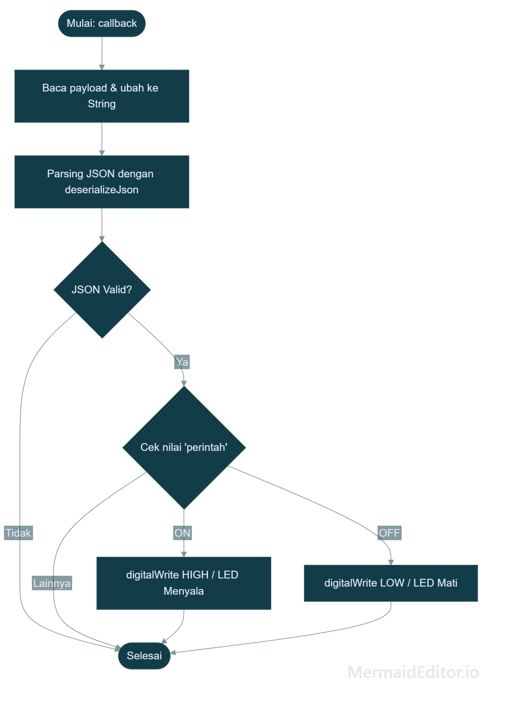
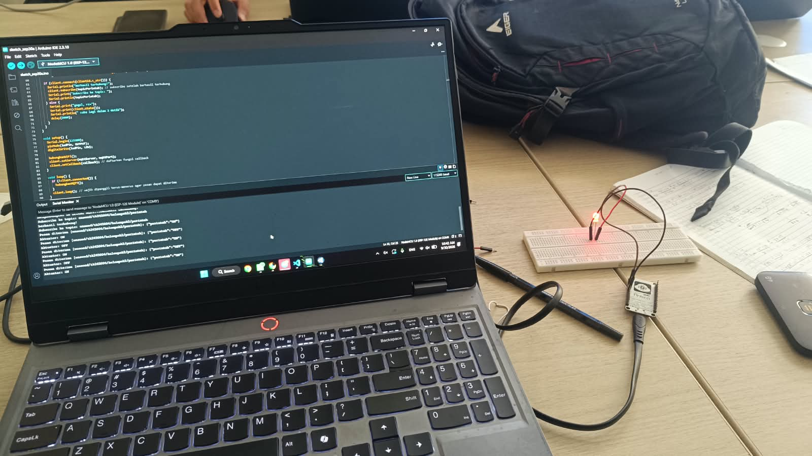
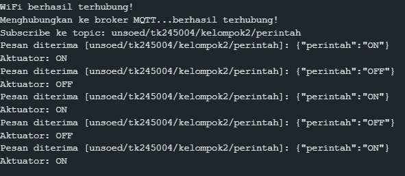
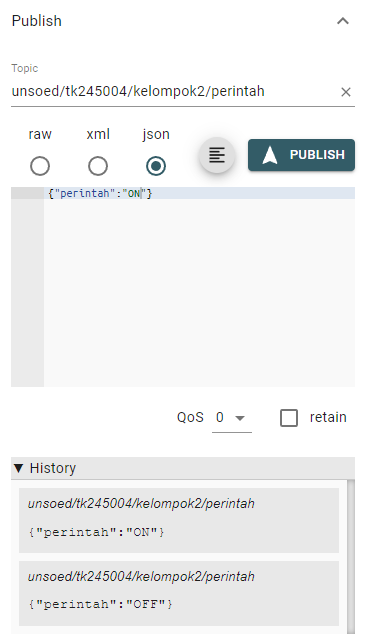

# Modul 4 - Komunikasi Pertukaran Data (Publish dan Subscribe dengan Format JSON)

Program 4A (Subscribe dan Deserialisasi Data JSON untuk Kendali Aktuator) berfungsi untuk mengonfigurasi perangkat agar dapat **menerima perintah kendali** dari broker MQTT melalui mekanisme *subscribe*, melakukan **deserialisasi data JSON** yang diterima, dan mengendalikan aktuator (LED) berdasarkan perintah tersebut.

Program 4B (Pertukaran Data Dua Arah) berfungsi untuk mengonfigurasi perangkat agar dapat **mempublikasikan data sensor** dan **menerima perintah kendali secara bersamaan** (*full duplex*) menggunakan arsitektur *publish-subscribe* dengan pendekatan *non-blocking* berbasis `millis()`.

---

## Penjelasan Kode, Fungsi dan Percabangan pada Percobaan 4A (Subscribe dan Deserialisasi Data JSON untuk Kendali Aktuator)

Program 4A berfungsi sebagai sistem penerima perintah (*subscriber*) berbasis MQTT yang mendengarkan pesan JSON pada suatu *topic* dan mengendalikan LED berdasarkan nilai perintah yang diterima.

### Inisialisasi & Konfigurasi

* `#include <WiFi.h>`: Mengimpor pustaka utama kontrol nirkabel WiFi pada ESP32.
* `#include <PubSubClient.h>`: Mengimpor pustaka untuk mengimplementasikan protokol MQTT (*publish/subscribe*).
* `#include <ArduinoJson.h>`: Mengimpor pustaka manipulasi, serialisasi, dan deserialisasi data format JSON.
* `const char *ssid = "Hazee"`: Menyimpan nama SSID jaringan WiFi target.
* `const char *password = "abcd1234"`: Menyimpan kata sandi jaringan WiFi.
* `const char *mqttServer = "broker.hivemq.com"`: Alamat host *broker* MQTT publik.
* `const int mqttPort = 1883`: Port standar komunikasi MQTT *unencrypted*.
* `const char *topicPerintah = "unsoed/tk245004/kelompok2/perintah"`: Jalur *topic* spesifik untuk menerima perintah kendali.
* `const int ledPin = 4`: Pin GPIO yang terhubung ke LED indikator.
* `WiFiClient espClient;` & `PubSubClient client(espClient);`: Inisialisasi instansiasi transport layer jaringan dan klien MQTT.

### Fungsi `callback()`

* `void callback(char* topic, byte* payload, unsigned int length)`: Fungsi yang akan dipanggil secara otomatis setiap kali ada pesan baru masuk pada *topic* yang di-*subscribe*.
* `String pesan; for (unsigned int i = 0; i < length; i++) { pesan += (char)payload[i]; }`: Mengonversi *payload* bertipe `byte*` menjadi `String` agar dapat diproses.
* `Serial.print("Pesan diterima ["); ... Serial.println(pesan);`: Menampilkan pesan mentah yang diterima ke Serial Monitor.
* `JsonDocument doc;`: Membuat objek `JsonDocument` untuk menampung hasil deserialisasi.
* `DeserializationError error = deserializeJson(doc, pesan);`: Melakukan deserialisasi teks JSON menjadi objek yang dapat diakses nilainya.
* `if (error) { ... return; }`: **Percabangan** — Jika deserialisasi gagal, program mencetak pesan error dan keluar dari fungsi `callback()`.
* `const char* perintah = doc["perintah"];`: Mengakses nilai dari *key* `"perintah"` pada objek JSON hasil deserialisasi.
* `if (String(perintah) == "ON") { digitalWrite(ledPin, HIGH); ... }`: **Percabangan** — Jika nilai perintah adalah `"ON"`, LED dinyalakan.
* `else if (String(perintah) == "OFF") { digitalWrite(ledPin, LOW); ... }`: **Percabangan** — Jika nilai perintah adalah `"OFF"`, LED dimatikan.

### Fungsi `hubungkanWiFi()`

Fungsi pembantu (*helper*) untuk menginisialisasi dan menahan alur program hingga ESP32 terhubung penuh ke jaringan WiFi menggunakan *looping* `while (WiFi.status() != WL_CONNECTED)`.

### Fungsi `hubungkanMQTT()`

* Menggunakan *loop* `while (!client.connected())` untuk memastikan status koneksi ke broker.
* `String clientId = "ESP32Client-" + String(random(0xffff), HEX);`: Membangun *Client ID* unik secara acak untuk menghindari konflik identitas koneksi pada *broker*.
* `if (client.connect(clientId.c_str()))`: Mencoba membuka sesi koneksi ke *broker*.
* `client.subscribe(topicPerintah);`: Mendaftarkan diri untuk menerima pesan dari *topic* perintah setelah berhasil terhubung.
* **Blok `ELSE`**: Jika gagal terhubung, program mencetak kode status kesalahan (`rc`) dan melakukan *retry delay* 2000 ms.

### Fungsi `setup()`

* `Serial.begin(115200);`: Membuka komunikasi serial pada kecepatan 115200 baud rate.
* `pinMode(ledPin, OUTPUT);`: Mengonfigurasi pin LED sebagai output.
* `digitalWrite(ledPin, LOW);`: Memastikan LED dalam keadaan mati saat inisialisasi.
* `hubungkanWiFi();`: Memanggil fungsi koneksi WiFi.
* `client.setServer(mqttServer, mqttPort);`: Mengonfigurasi parameter alamat dan port target *broker* MQTT.
* `client.setCallback(callback);`: Mendaftarkan fungsi `callback` yang akan dijalankan ketika pesan diterima.

### Fungsi `loop()`

* `if (!client.connected()) { hubungkanMQTT(); }`: **Percabangan** — Memeriksa status koneksi MQTT. Jika terputus, memanggil `hubungkanMQTT()` untuk menyambung ulang.
* `client.loop();`: Fungsi wajib yang memproses *keep-alive*, *ping packet*, dan pemrosesan pesan masuk pada *stack* PubSubClient.

### Percabangan/Conditional

1. **Pengecekan Hasil Deserialisasi (`if (error)`)**
   * **Kondisi `TRUE`:** Deserialisasi JSON gagal (format tidak valid). Program mencetak pesan error dan keluar dari fungsi `callback()` tanpa mengubah status LED.
   * **Kondisi `FALSE`:** Deserialisasi berhasil, program melanjutkan untuk membaca nilai `"perintah"`.

2. **Pengecekan Nilai Perintah (`if (String(perintah) == "ON")` / `else if (String(perintah) == "OFF")`)**
   * **Kondisi `"ON"`:** LED dinyalakan (`HIGH`) dan Serial Monitor menampilkan `"Aktuator: ON"`.
   * **Kondisi `"OFF"`:** LED dimatikan (`LOW`) dan Serial Monitor menampilkan `"Aktuator: OFF"`.

3. **Pengecekan Koneksi MQTT (`if (!client.connected())`)**
   Menjamin proses *subscribe* tetap berjalan dengan menyambung ulang ke broker jika koneksi terputus.

4. **Proses Autentikasi/Handshake MQTT (`if (client.connect(...))`)**
   * **Kondisi `TRUE`:** Berhasil *connect*, program melakukan `subscribe` ke *topic* perintah dan mencetak pesan konfirmasi.
   * **Blok `ELSE`:** Gagal terhubung, program mencetak kode status kesalahan (`rc`) dan melakukan *retry delay* 2000 ms.

---

## Penjelasan Kode, Fungsi dan Percabangan pada Percobaan 4B (Pertukaran Data Dua Arah / Full Duplex)

Program 4B berfungsi sebagai sistem IoT *full duplex* yang dapat **mempublikasikan data sensor** (suhu dan kelembapan) secara berkala ke *topic* data, sekaligus **menerima perintah kendali** aktuator dari *topic* perintah secara bersamaan tanpa saling mengganggu.

### Inisialisasi & Konfigurasi

* `#include <WiFi.h>`: Mengimpor pustaka utama kontrol nirkabel WiFi pada ESP32.
* `#include <PubSubClient.h>`: Pustaka utama untuk mengimplementasikan protokol MQTT (*publish/subscribe*).
* `#include <ArduinoJson.h>`: Pustaka manipulasi, serialisasi, dan deserialisasi data format JSON.
* `const char* ssid = "Hazee"`: Menyimpan nama SSID jaringan WiFi target.
* `const char* password = "abcd1234"`: Menyimpan kata sandi jaringan WiFi.
* `const char* mqttServer = "broker.hivemq.com"`: Alamat host *broker* MQTT publik.
* `const int mqttPort = 1883`: Port standar komunikasi MQTT *unencrypted*.
* `const char* topicData = "unsoed/tk245004/kelompok2/data"`: Jalur *topic* untuk mempublikasikan data sensor.
* `const char* topicPerintah = "unsoed/tk245004/kelompok2/perintah"`: Jalur *topic* untuk menerima perintah kendali.
* `const int ledPin = 4`: Pin GPIO yang terhubung ke LED indikator.
* `WiFiClient espClient;` & `PubSubClient client(espClient);`: Inisialisasi instansiasi transport layer jaringan dan klien MQTT.
* `unsigned long waktuTerakhirPublish = 0;`: Variabel untuk menyimpan timestamp terakhir kali publish dilakukan (untuk mekanisme *non-blocking*).
* `const long intervalPublish = 5000;`: Interval waktu publish data sensor (5000 ms = 5 detik).

### Fungsi `callback()`

* `void callback(char* topic, byte* payload, unsigned int length)`: Fungsi yang dipanggil otomatis setiap ada pesan baru masuk pada *topic* yang di-*subscribe*.
* `String pesan; for (unsigned int i = 0; i < length; i++) pesan += (char)payload[i];`: Mengonversi *payload* menjadi `String`.
* `JsonDocument doc;`: Membuat objek `JsonDocument` untuk menampung hasil deserialisasi.
* `if (deserializeJson(doc, pesan)) return;`: **Percabangan** — Jika deserialisasi gagal, program langsung keluar dari fungsi `callback()` tanpa mengubah status aktuator.
* `const char* perintah = doc["perintah"];`: Mengakses nilai dari *key* `"perintah"` pada objek JSON.
* `digitalWrite(ledPin, String(perintah) == "ON" ? HIGH : LOW);`: **Percabangan ternary** — Jika perintah `"ON"`, LED dinyalakan; jika tidak, LED dimatikan.
* `Serial.print("Perintah diterima -> Aktuator: "); Serial.println(perintah);`: Menampilkan status aktuator ke Serial Monitor.

### Fungsi `hubungkanWiFi()`

Fungsi pembantu (*helper*) untuk menginisialisasi dan menahan alur program hingga ESP32 terhubung penuh ke jaringan WiFi.

### Fungsi `hubungkanMQTT()`

* Menggunakan *loop* `while (!client.connected())` untuk memastikan status koneksi ke broker.
* `String clientId = "ESP8266Client-" + String(random(0xffff), HEX);`: Membangun *Client ID* unik secara acak.
* `if (client.connect(clientId.c_str()))`: Mencoba membuka sesi koneksi ke *broker*.
* `client.subscribe(topicPerintah);`: Mendaftarkan diri untuk menerima pesan dari *topic* perintah.
* **Blok `ELSE`**: Jika gagal terhubung, program mencetak kode status kesalahan dan melakukan *retry delay* 2000 ms.

### Fungsi `setup()`

* `Serial.begin(115200);`: Membuka komunikasi serial pada kecepatan 115200 baud rate.
* `pinMode(ledPin, OUTPUT);`: Mengonfigurasi pin LED sebagai output.
* `digitalWrite(ledPin, LOW);`: Memastikan LED dalam keadaan mati saat inisialisasi.
* `hubungkanWiFi();`: Memanggil fungsi koneksi WiFi.
* `client.setServer(mqttServer, mqttPort);`: Mengonfigurasi parameter alamat dan port target *broker* MQTT.
* `client.setCallback(callback);`: Mendaftarkan fungsi `callback` yang akan dijalankan ketika pesan diterima.

### Fungsi `loop()`

* `if (!client.connected()) hubungkanMQTT();`: **Percabangan** — Memeriksa status koneksi MQTT. Jika terputus, memanggil `hubungkanMQTT()` untuk menyambung ulang.
* `client.loop();`: Fungsi wajib yang memproses *keep-alive*, *ping packet*, dan pemrosesan pesan masuk secara terus-menerus.
* **Mekanisme Non-Blocking Publish:**
  * `if (millis() - waktuTerakhirPublish > intervalPublish)`: **Percabangan** — Memeriksa apakah sudah waktunya untuk publish data berikutnya berdasarkan selisih waktu saat ini dengan waktu publish terakhir.
  * `waktuTerakhirPublish = millis();`: Memperbarui timestamp terakhir publish.
  * `float suhu = 25.0 + (random(0, 1000) / 100.0);`: Membuat data dummy suhu acak antara 25.0 - 35.0 °C.
  * `float kelembapan = 40.0 + (random(0, 4000) / 100.0);`: Membuat data dummy kelembapan acak antara 40.0 - 80.0 %.
  * `JsonDocument doc; doc["suhu"] = suhu; doc["kelembapan"] = kelembapan; doc["sumber"] = "dummy";`: Menyusun payload JSON.
  * `char buffer[128]; serializeJson(doc, buffer);`: Mengonversi objek JSON menjadi *character array*.
  * `client.publish(topicData, buffer);`: Mempublikasikan data sensor ke *topic* data.
  * `Serial.print("Data dummy terkirim: "); Serial.println(buffer);`: Menampilkan data yang dikirim ke Serial Monitor.

### Percabangan/Conditional

1. **Pengecekan Koneksi MQTT (`if (!client.connected())`)**
   Menjamin proses *publish* dan *subscribe* tidak akan dipaksakan jika hubungan socket TCP ke broker MQTT belum terbentuk/terputus.

2. **Proses Autentikasi/Handshake MQTT (`if (client.connect(...))`)**
   * **Kondisi `TRUE`:** Berhasil *connect*, program melakukan `subscribe` ke *topic* perintah dan mencetak pesan konfirmasi.
   * **Blok `ELSE`:** Gagal terhubung, program mencetak kode status kesalahan dan melakukan *retry delay* 2000 ms.

3. **Pengecekan Hasil Deserialisasi (`if (deserializeJson(doc, pesan))`)**
   * **Kondisi `TRUE`:** Deserialisasi JSON gagal (format tidak valid). Program langsung keluar dari fungsi `callback()` tanpa mengubah status aktuator.
   * **Kondisi `FALSE`:** Deserialisasi berhasil, program melanjutkan untuk membaca nilai `"perintah"`.

4. **Pengecekan Waktu Publish (`if (millis() - waktuTerakhirPublish > intervalPublish)`)**
   * **Kondisi `TRUE`:** Sudah waktunya untuk publish data berikutnya. Program membaca sensor dan mempublikasikan data ke *topic* data.
   * **Kondisi `FALSE`:** Belum waktunya publish. Program tidak melakukan apa-apa dan kembali ke awal `loop()`.

5. **Pengecekan Nilai Perintah (`String(perintah) == "ON" ? HIGH : LOW`)**
   * **Kondisi `"ON"`:** LED dinyalakan (`HIGH`).
   * **Kondisi Selain `"ON"`:** LED dimatikan (`LOW`).

---

## Library / Dependencies

| Library / Dependency | Fungsi Utama |
| --- | --- |
| **WiFi.h** | Mengelola koneksi nirkabel fisik/datalink layer ke jaringan Wi-Fi lokal. |
| **PubSubClient.h** | Mengimplementasikan protokol MQTT (connect, publish, subscribe, loop keep-alive). |
| **ArduinoJson.h** | Mengelola alokasi memori, konstruksi objek key-value, serialisasi, serta deserialisasi JSON. |

---

## Pertanyaan Praktikum

### Percobaan 4A

1. Gambarkan diagram alur (flowchart) proses penerimaan dan pemrosesan pesan pada fungsi callback di atas!
**Jawab:**
<br></img>

2. Apa yang akan terjadi apabila pesan yang dipublikasikan bukan merupakan format JSON yang valid?
**Jawab:** Apabila pesan yang dipublikasikan bukan merupakan format JSON yang valid, fungsi `deserializeJson(doc, pesan)` akan mengembalikan nilai error (`DeserializationError`). Program kemudian akan mencetak pesan `"Gagal parsing JSON: <error>"` ke Serial Monitor dan langsung keluar dari fungsi `callback()` melalui perintah `return`. Akibatnya, status LED tidak akan berubah dan pesan tersebut diabaikan.

3. Jelaskan mengapa fungsi `client.subscribe()` dipanggil di dalam fungsi `hubungkanMQTT()`, bukan di dalam `setup()`!
**Jawab:** Fungsi `client.subscribe()` dipanggil di dalam `hubungkanMQTT()` karena proses *subscribe* hanya dapat dilakukan setelah koneksi ke broker MQTT berhasil terbentuk. Jika diletakkan di dalam `setup()`, maka *subscribe* hanya akan dilakukan satu kali saat inisialisasi. Padahal, koneksi MQTT dapat terputus sewaktu-waktu (misalnya karena masalah jaringan), dan ketika tersambung kembali, ESP32 perlu melakukan *subscribe* ulang ke *topic* perintah. Dengan menempatkannya di dalam `hubungkanMQTT()` yang dipanggil setiap kali koneksi terputus, maka *subscribe* akan selalu dilakukan ulang setiap kali koneksi berhasil dipulihkan.

4. Modifikasi program agar data JSON yang diterima juga memuat nilai intensitas (misalnya `{"perintah": "ON", "intensitas": 200}`) yang digunakan untuk mengatur kecerahan LED menggunakan PWM (`analogWrite`/`ledcWrite`), dan berikan penjelasan di setiap baris kode yang ditambahkan dalam bentuk README.md!

**Jawab:**

```cpp
#include <WiFi.h>
#include <PubSubClient.h>
#include <ArduinoJson.h>

const char *ssid = "Hazee";
const char *password = "abcd1234";
const char *mqttServer = "broker.hivemq.com";
const int mqttPort = 1883;
const char *topicPerintah = "unsoed/tk245004/kelompok2/perintah";
const int ledPin = 4;

// ==================== KONFIGURASI PWM ====================
const int pwmChannel = 0;        // Kanal PWM yang digunakan (0-15 pada ESP32)
const int pwmFrequency = 5000;   // Frekuensi PWM dalam Hz
const int pwmResolution = 8;     // Resolusi PWM 8-bit (nilai 0-255)

WiFiClient espClient;
PubSubClient client(espClient);

// Fungsi callback dipanggil otomatis setiap ada pesan baru masuk
void callback(char* topic, byte* payload, unsigned int length) {
  String pesan;
  for (unsigned int i = 0; i < length; i++) {
    pesan += (char)payload[i];
  }

  Serial.print("Pesan diterima [");
  Serial.print(topic);
  Serial.print("]: ");
  Serial.println(pesan);

  // Deserialisasi data JSON yang diterima
  JsonDocument doc;
  DeserializationError error = deserializeJson(doc, pesan);
  if (error) {
    Serial.print("Gagal parsing JSON: ");
    Serial.println(error.c_str());
    return;
  }

  const char* perintah = doc["perintah"];
  
  // ==================== PEMBACAAN NILAI INTENSITAS ====================
  int intensitas = doc["intensitas"] | 255;  // Membaca nilai "intensitas", default 255 jika tidak ada

  if (String(perintah) == "ON") {
    // ==================== MENGGUNAKAN ledcWrite UNTUK PWM ====================
    ledcWrite(pwmChannel, intensitas);  // Mengatur kecerahan LED sesuai nilai intensitas (0-255)
    Serial.print("Aktuator: ON dengan intensitas ");
    Serial.println(intensitas);
  } else if (String(perintah) == "OFF") {
    ledcWrite(pwmChannel, 0);  // Mematikan LED dengan PWM duty cycle 0
    Serial.println("Aktuator: OFF");
  }
}

void hubungkanWiFi() {
  WiFi.begin(ssid, password);
  Serial.print("Menghubungkan ke WiFi");
  while (WiFi.status() != WL_CONNECTED) {
    delay(500);
    Serial.print(".");
  }
  Serial.println("\nWiFi berhasil terhubung!");
}

void hubungkanMQTT() {
  while (!client.connected()) {
    Serial.print("Menghubungkan ke broker MQTT...");
    String clientId = "ESP32Client-" + String(random(0xffff), HEX);

    if (client.connect(clientId.c_str())) {
      Serial.println("berhasil terhubung!");
      client.subscribe(topicPerintah);
      Serial.print("Subscribe ke topic: ");
      Serial.println(topicPerintah);
    } else {
      Serial.print("gagal, rc=");
      Serial.print(client.state());
      Serial.println(" coba lagi dalam 2 detik");
      delay(2000);
    }
  }
}

void setup() {
  Serial.begin(115200);
  
  // ==================== INISIALISASI PWM ====================
  ledcSetup(pwmChannel, pwmFrequency, pwmResolution);  // Mengonfigurasi kanal PWM dengan frekuensi dan resolusi
  ledcAttachPin(ledPin, pwmChannel);                    // Menghubungkan pin LED ke kanal PWM
  
  ledcWrite(pwmChannel, 0);  // Memastikan LED mati saat inisialisasi

  hubungkanWiFi();
  client.setServer(mqttServer, mqttPort);
  client.setCallback(callback);
}

void loop() {
  if (!client.connected()) {
    hubungkanMQTT();
  }
  client.loop();
}
```

**Penjelasan Setiap Baris Kode yang Ditambahkan:**

| Baris Kode | Penjelasan |
| --- | --- |
| `const int pwmChannel = 0;` | Mendefinisikan kanal PWM yang digunakan (ESP32 memiliki 16 kanal PWM, 0-15). |
| `const int pwmFrequency = 5000;` | Menentukan frekuensi PWM sebesar 5000 Hz (5 kHz). |
| `const int pwmResolution = 8;` | Menentukan resolusi PWM 8-bit, sehingga nilai duty cycle berkisar 0-255. |
| `int intensitas = doc["intensitas"] \| 255;` | Membaca nilai `"intensitas"` dari JSON. Operator `\|` digunakan sebagai nilai default 255 jika key `"intensitas"` tidak ada. |
| `ledcWrite(pwmChannel, intensitas);` | Menulis nilai duty cycle ke kanal PWM untuk mengatur kecerahan LED (0 = mati, 255 = paling terang). |
| `ledcWrite(pwmChannel, 0);` | Mematikan LED dengan mengatur duty cycle ke 0. |
| `ledcSetup(pwmChannel, pwmFrequency, pwmResolution);` | Mengonfigurasi kanal PWM dengan frekuensi dan resolusi yang telah ditentukan. |
| `ledcAttachPin(ledPin, pwmChannel);` | Menghubungkan pin GPIO LED ke kanal PWM yang telah dikonfigurasi. |
| `ledcWrite(pwmChannel, 0);` (di setup) | Memastikan LED dalam keadaan mati saat inisialisasi. |

**Perilaku Output:**
- Menerima `{"perintah": "ON", "intensitas": 200}` → LED menyala dengan kecerahan 200/255 (~78%).
- Menerima `{"perintah": "ON"}` → LED menyala dengan kecerahan maksimal (255) karena nilai default.
- Menerima `{"perintah": "OFF"}` → LED mati.

---

### Percobaan 4B

1. Mengapa penggunaan `delay()` yang lama sebaiknya dihindari pada program yang menggabungkan proses publish dan subscribe secara bersamaan?
**Jawab:** Penggunaan `delay()` yang lama sebaiknya dihindari karena `delay()` bersifat *blocking*, yaitu menghentikan seluruh eksekusi program pada periode waktu tertentu. Selama `delay()` berlangsung, fungsi `client.loop()` tidak dapat dipanggil, sehingga:
- Pesan MQTT yang masuk tidak akan diproses dan diteruskan ke fungsi `callback()`.
- Koneksi ke broker MQTT tidak dijaga dengan paket *keep-alive*, sehingga berisiko terputus.
- Perintah kendali aktuator tidak akan responsif karena tertunda hingga `delay()` selesai.

2. Jelaskan cara kerja mekanisme non-blocking menggunakan fungsi `millis()` pada program di atas!
**Jawab:** Mekanisme *non-blocking* menggunakan `millis()` bekerja dengan cara:
- `millis()` mengembalikan jumlah milidetik sejak ESP32 dinyalakan.
- Variabel `waktuTerakhirPublish` menyimpan timestamp kapan terakhir kali publish dilakukan.
- Pada setiap iterasi `loop()`, program memeriksa `if (millis() - waktuTerakhirPublish > intervalPublish)`.
- Jika selisih waktu melebihi interval yang ditentukan (5000 ms), maka program akan melakukan publish dan memperbarui `waktuTerakhirPublish = millis()`.
- Jika belum waktunya, program tidak melakukan apa-apa dan langsung melanjutkan ke iterasi berikutnya.
- Dengan cara ini, `client.loop()` tetap dipanggil secara terus-menerus tanpa terhambat, sehingga pesan masuk tetap diproses secara *real-time*.

3. Apa yang akan terjadi apabila fungsi `client.loop()` jarang dipanggil (misalnya hanya sekali setiap 10 detik)?
**Jawab:** Jika `client.loop()` jarang dipanggil, maka:
- Pesan MQTT yang masuk akan tertunda pemrosesannya hingga `client.loop()` dipanggil kembali, sehingga perintah kendali aktuator tidak responsif.
- Paket *keep-alive* tidak terkirim tepat waktu, sehingga broker MQTT mungkin menganggap koneksi terputus dan memutuskan sesi.
- Buffer jaringan pada PubSubClient dapat menumpuk dan menyebabkan masalah memori.
- Koneksi ke broker MQTT menjadi tidak stabil dan sering terputus.

4. Modifikasi program agar menambahkan satu topic perintah baru untuk mengendalikan aktuator kedua (misalnya buzzer), dengan fungsi callback yang dapat membedakan topic mana yang menerima pesan, dan berikan penjelasan di setiap baris kode yang ditambahkan dalam bentuk README.md!

**Jawab:**

```cpp
#include <WiFi.h>
#include <PubSubClient.h>
#include <ArduinoJson.h>

// ==================== KONFIGURASI WIFI & MQTT ====================
const char* ssid = "Hazee";
const char* password = "abcd1234";
const char* mqttServer = "broker.hivemq.com";
const int mqttPort = 1883;

const char* topicData     = "unsoed/tk245004/kelompok2/data";
const char* topicPerintah = "unsoed/tk245004/kelompok2/perintah";
const char* topicBuzzer   = "unsoed/tk245004/kelompok2/buzzer";  // Topic baru untuk buzzer

// ==================== KONFIGURASI PIN ====================
const int ledPin = 4;      // Pin LED
const int buzzerPin = 5;   // Pin Buzzer (GPIO 5)

WiFiClient espClient;
PubSubClient client(espClient);

// ==================== VARIABEL NON-BLOCKING TIMER ====================
unsigned long waktuTerakhirPublish = 0;
const long intervalPublish = 5000;  // publish data setiap 5 detik

// ==================== CALLBACK: MENERIMA PESAN MQTT ====================
void callback(char* topic, byte* payload, unsigned int length) {
  String pesan;
  for (unsigned int i = 0; i < length; i++) {
    pesan += (char)payload[i];
  }

  Serial.print("Pesan diterima [");
  Serial.print(topic);
  Serial.print("]: ");
  Serial.println(pesan);

  JsonDocument doc;
  if (deserializeJson(doc, pesan)) {
    Serial.println("Gagal parsing JSON");
    return;
  }

  // ==================== PERCABANGAN BERDASARKAN TOPIC ====================
  if (String(topic) == topicPerintah) {
    // Proses untuk topic perintah (LED)
    const char* perintah = doc["perintah"];
    digitalWrite(ledPin, String(perintah) == "ON" ? HIGH : LOW);
    Serial.print("Perintah LED -> Aktuator: ");
    Serial.println(perintah);
  } 
  else if (String(topic) == topicBuzzer) {
    // Proses untuk topic buzzer
    const char* perintah = doc["perintah"];
    digitalWrite(buzzerPin, String(perintah) == "ON" ? HIGH : LOW);
    Serial.print("Perintah Buzzer -> Aktuator: ");
    Serial.println(perintah);
  }
}

// ==================== FUNGSI KONEKSI WIFI ====================
void hubungkanWiFi() {
  WiFi.begin(ssid, password);
  Serial.print("Menghubungkan ke WiFi");
  while (WiFi.status() != WL_CONNECTED) {
    delay(500);
    Serial.print(".");
  }
  Serial.println("\nWiFi berhasil terhubung!");
}

// ==================== FUNGSI KONEKSI MQTT ====================
void hubungkanMQTT() {
  while (!client.connected()) {
    Serial.print("Menghubungkan ke broker MQTT...");
    String clientId = "ESP32Client-" + String(random(0xffff), HEX);

    if (client.connect(clientId.c_str())) {
      Serial.println("berhasil!");
      
      // ==================== SUBSCRIBE KE KEDUA TOPIC ====================
      client.subscribe(topicPerintah);
      Serial.print("Subscribe ke topic: ");
      Serial.println(topicPerintah);
      
      client.subscribe(topicBuzzer);
      Serial.print("Subscribe ke topic: ");
      Serial.println(topicBuzzer);
    } else {
      Serial.print("gagal, rc=");
      Serial.print(client.state());
      Serial.println(" coba lagi dalam 2 detik");
      delay(2000);
    }
  }
}

// ==================== SETUP ====================
void setup() {
  Serial.begin(115200);
  
  // ==================== INISIALISASI PIN ====================
  pinMode(ledPin, OUTPUT);
  pinMode(buzzerPin, OUTPUT);
  digitalWrite(ledPin, LOW);
  digitalWrite(buzzerPin, LOW);

  hubungkanWiFi();
  client.setServer(mqttServer, mqttPort);
  client.setCallback(callback);
}

// ==================== LOOP UTAMA ====================
void loop() {
  if (!client.connected()) hubungkanMQTT();
  client.loop();

  // Publish data dummy secara berkala
  if (millis() - waktuTerakhirPublish > intervalPublish) {
    waktuTerakhirPublish = millis();

    float suhu = 25.0 + (random(0, 1000) / 100.0);
    float kelembapan = 40.0 + (random(0, 4000) / 100.0);

    JsonDocument doc;
    doc["suhu"] = suhu;
    doc["kelembapan"] = kelembapan;
    doc["sumber"] = "dummy";

    char buffer[128];
    serializeJson(doc, buffer);
    client.publish(topicData, buffer);

    Serial.print("Data dummy terkirim: ");
    Serial.println(buffer);
  }
}
```

**Penjelasan Setiap Baris Kode yang Ditambahkan:**

| Baris Kode | Penjelasan |
| --- | --- |
| `const char* topicBuzzer = "unsoed/tk245004/kelompok2/buzzer";` | Mendefinisikan topic MQTT baru untuk menerima perintah kendali buzzer. |
| `const int buzzerPin = 5;` | Mendefinisikan pin GPIO 5 sebagai pin output untuk buzzer. |
| `if (String(topic) == topicPerintah)` | **Percabangan** — Memeriksa apakah pesan diterima dari topic perintah (LED). |
| `else if (String(topic) == topicBuzzer)` | **Percabangan** — Memeriksa apakah pesan diterima dari topic buzzer. |
| `digitalWrite(buzzerPin, String(perintah) == "ON" ? HIGH : LOW);` | Mengendalikan buzzer berdasarkan nilai perintah (`"ON"` = bunyi, `"OFF"` = mati). |
| `Serial.print("Perintah Buzzer -> Aktuator: ");` | Menampilkan status aktuator buzzer ke Serial Monitor. |
| `client.subscribe(topicBuzzer);` | Mendaftarkan diri untuk menerima pesan dari topic buzzer. |
| `pinMode(buzzerPin, OUTPUT);` | Mengonfigurasi pin buzzer sebagai output. |
| `digitalWrite(buzzerPin, LOW);` | Memastikan buzzer dalam keadaan mati saat inisialisasi. |

**Cara Pengujian:**
- Publish `{"perintah": "ON"}` ke topic `unsoed/tk245004/kelompok2/perintah` → LED menyala.
- Publish `{"perintah": "OFF"}` ke topic `unsoed/tk245004/kelompok2/perintah` → LED mati.
- Publish `{"perintah": "ON"}` ke topic `unsoed/tk245004/kelompok2/buzzer` → Buzzer berbunyi.
- Publish `{"perintah": "OFF"}` ke topic `unsoed/tk245004/kelompok2/buzzer` → Buzzer mati.

---

## Pertanyaan Analisis

1. Uraikan hasil tugas pada praktikum yang telah dilakukan pada setiap percobaan!
**Jawab:** Pada Percobaan 4A, ESP32 berhasil terhubung ke WiFi dan broker MQTT, melakukan *subscribe* ke topic `unsoed/tk245004/kelompok2/perintah`, menerima pesan JSON `{"perintah": "ON"}` dan `{"perintah": "OFF"}` dari MQTT client, melakukan deserialisasi dengan benar, serta mengendalikan LED pada GPIO 4 sesuai perintah yang diterima. Serial Monitor menampilkan pesan mentah yang diterima beserta hasil parsing dan status aktuator. Pada Percobaan 4B, ESP32 berhasil menjalankan komunikasi *full duplex* dengan mempublikasikan data dummy suhu dan kelembapan ke topic `unsoed/tk245004/kelompok2/data` setiap 5 detik menggunakan mekanisme *non-blocking* berbasis `millis()`, sementara secara bersamaan tetap responsif menerima perintah kendali LED melalui topic `unsoed/tk245004/kelompok2/perintah` tanpa saling mengganggu. Sistem berjalan stabil tanpa terputus dari broker selama pengujian.

2. Bandingkan mekanisme komunikasi satu arah (publish saja, seperti pada Modul Praktikum 3) dengan komunikasi dua arah (publish dan subscribe) yang diimplementasikan pada modul ini!
**Jawab:** 

| Aspek | Komunikasi Satu Arah (Modul 3) | Komunikasi Dua Arah (Modul 4) |
| --- | --- | --- |
| **Pola Komunikasi** | Hanya *publish* (perangkat → broker) | *Publish* dan *subscribe* (perangkat ↔ broker) |
| **Fungsi Callback** | Tidak diperlukan | Diperlukan untuk menangani pesan masuk |
| **Interaktivitas** | Pasif, hanya mengirim data | Aktif, dapat menerima perintah kendali |
| **Kontrol Aktuator** | Tidak dapat dilakukan dari jarak jauh | Dapat dilakukan secara *real-time* |
| **Kompleksitas Kode** | Lebih sederhana | Lebih kompleks (perlu `setCallback`, `subscribe`, `client.loop()`) |
| **Responsivitas** | N/A | Perlu menjaga `client.loop()` tetap berjalan |

Komunikasi dua arah memungkinkan sistem IoT untuk tidak hanya memantau (monitoring) tetapi juga mengendalikan (control) perangkat dari jarak jauh, sehingga lebih fleksibel dan interaktif.

3. Mengapa pendekatan non-blocking (menggunakan `millis()`) lebih sesuai dibandingkan pendekatan blocking (menggunakan `delay()`) pada sistem IoT yang memerlukan komunikasi dua arah secara real-time?
**Jawab:** Pendekatan *non-blocking* dengan `millis()` lebih sesuai karena:
- **Responsivitas:** `client.loop()` dapat dipanggil secara terus-menerus tanpa terhambat, sehingga pesan MQTT yang masuk (seperti perintah kendali) dapat segera diproses dan diteruskan ke fungsi `callback()`.
- **Koneksi Stabil:** Paket *keep-alive* MQTT terkirim tepat waktu sehingga broker tidak memutus koneksi.
- **Paralelisme Semu:** Meskipun mikrokontroler hanya menjalankan satu program, `millis()` memungkinkan beberapa tugas (publish berkala dan subscribe pesan masuk) berjalan secara bergantian tanpa saling memblokir.
- **Efisiensi:** Tidak ada waktu yang terbuang hanya untuk menunggu, sehingga CPU dapat digunakan untuk memproses tugas lain.

Sebaliknya, `delay()` yang *blocking* akan menghentikan seluruh program, menyebabkan pesan MQTT tidak diproses, koneksi terputus, dan aktuator tidak responsif.

4. Berikan contoh penerapan komunikasi dan pertukaran data dua arah pada sistem IoT nyata (sesuaikan dengan bidang peminatan masing-masing mahasiswa), dan jelaskan manfaatnya dibandingkan sistem yang hanya satu arah!
**Jawab:** Contoh penerapan pada bidang **Smart Agriculture (Pertanian Cerdas)**:
- **Sensor:** ESP32 membaca data suhu, kelembapan tanah, dan intensitas cahaya, lalu mempublikasikannya ke topic `pertanian/sensor`.
- **Aktuator:** Pompa air (relay), lampu grow LED, dan kipas pendingin.
- **Komunikasi Dua Arah:**
  - **Publish:** Data sensor dikirim ke broker MQTT secara berkala.
  - **Subscribe:** Petani dapat mengirim perintah dari aplikasi mobile ke topic `pertanian/perintah/pompa` untuk menyalakan/mematikan pompa air, atau topic `pertanian/perintah/lampu` untuk mengatur kecerahan lampu.
- **Manfaat dibandingkan satu arah:**
  - **Monitoring Real-time:** Petani dapat memantau kondisi lahan dari jarak jauh.
  - **Kontrol Jarak Jauh:** Petani dapat mengendalikan aktuator tanpa harus berada di lokasi.
  - **Otomatisasi Cerdas:** Sistem dapat mengambil keputusan berdasarkan data sensor (misalnya menyalakan pompa jika kelembapan tanah < 30%).
  - **Efisiensi Sumber Daya:** Air dan listrik digunakan secara optimal karena aktuator hanya dinyalakan saat diperlukan.
  - **Respons Cepat:** Jika terjadi kondisi darurat (misalnya suhu terlalu tinggi), petani dapat segera menyalakan kipas pendingin melalui perintah jarak jauh.

---

## Dokumentasi

### Percobaan 4A (Subscribe dan Deserialisasi Data JSON)

**Rangkaian & Pengujian Subscribe JSON:**
<br></img>
<br></img>
<br></img>

### Percobaan 4B (Pertukaran Data Dua Arah)

**Serial Monitor & MQTT Explorer:**
<br></img>
<br></img>